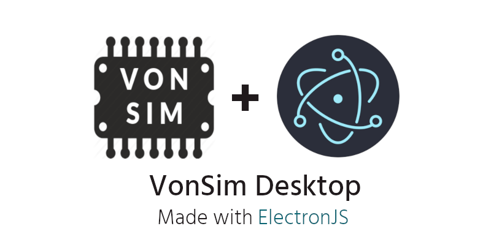

VonSim Desktop is a desktop wrapper for [VonSim](https://github.com/vonsim/vonsim) built with [ElectronJS](https://github.com/electron/electron). 


## 📀 Installation

Download the [latest releases](https://github.com/ZetLink/VonSim-Desktop/releases) for **Windows (x64)**

## ✏️ Development

```sh
git clone https://github.com/ZetLink/VonSim-Desktop.git
cd VonSim-Desktop
npm install
```

```sh
$ npm run
    - start
      electron .
   - build
      electron-builder --windows nsis:x64 -p never
```
